# Create Checkerboard Calibration Video
1. Prepare checker board  
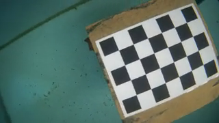
1. Checkerboard squares must be of equal size, measure the distance between each square
1. Ensure that the checkboard is perfectly flat throughout the process. A solid backing is required if it's a printed paper, so that it doesn't bend when it is being moved around.
1. Move the checkerboard to cover the entire video field of view, move it over all pixels
1. All the checkerboard intersection points need to be in the image frame to be counted as a proper detection.
1. Focus on covering all the corners and side which are more difficult
<p float="left">
  
  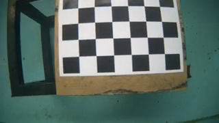
  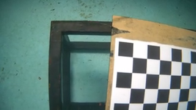
</p>

7. The goal is to have the checkerboard cover all the pixels in the video frame image with all the different position, each color shows one set of checkerboard:  
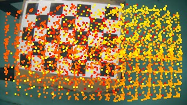

5. Example Video:  
[Example Checkerboard Video](../../test/Vid_20131219_105014_small_180p.mp4?raw=true)


## Example of checkboard video frames needed
[example_results/Vid_20131219_105014_small_180p_s10_raw](example_results/Vid_20131219_105014_small_180p_s10_raw) 
<p float="left">
  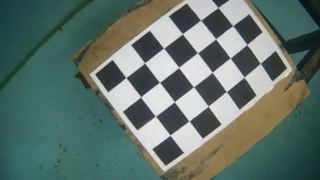
  
  
  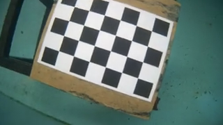
  
  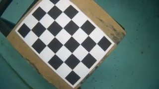
  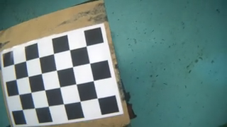
  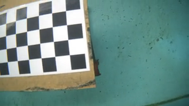
</p>
<p float="left">
  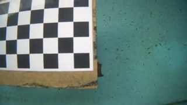
  
  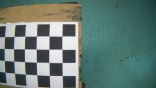
  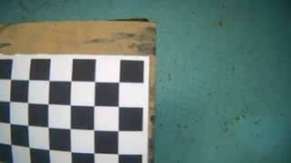
  
  
  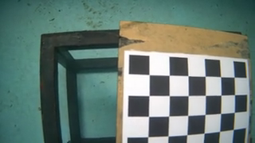
  
</p>
<p float="left">
  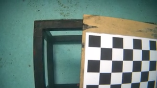
  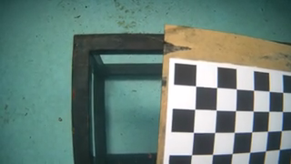
  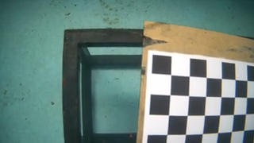
  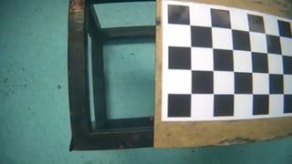
  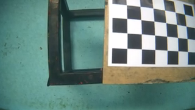
  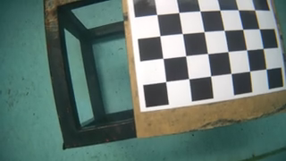
  
  
</p>


# Calibrate the Video File
1. Create directory called ```CameraCalibration``` on your desktop
2. Put all the videos you want to analyse in that director
3. Install Julia 1.7.2 (https://julialang.org/downloads/oldreleases/): [Windows 64bits](https://julialang-s3.julialang.org/bin/winnt/x64/1.7/julia-1.7.2-win64.exe), [MacOS M1](https://julialang-s3.julialang.org/bin/mac/aarch64/1.7/julia-1.7.2-macaarch64.dmg), [MacOS Intel](https://julialang-s3.julialang.org/bin/mac/x64/1.7/julia-1.7.2-mac64.dmg)
4. start julia
5. Install this CameraCalibration package:
```
using Pkg
Pkg.add(url="https://github.com/AbelHo/CameraCalibration.jl")
using CameraCalibration
```
6. This command will automatically search for the directory(Desktop/CameraCalibration) and process all the videos in it
```
calibrate_video_checkerboard()
```
7. If the checkerboard rows and columns number is different than the above example, change the following [4,6] to [row,column]
```
calibrate_video_checkerboard([4,6]);
```
8. After processing the video it will output the following to show you how well you have covered the checkerboard over the entire image pixel:  


9. This will show you the selected good images and the checkerboard coverage:  
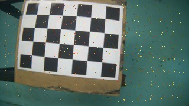

# Example result of checkerboard detection:
The calibration will select the best images required as shown below and show a yellow dot on the detected checkerboard intersection  
[example_results/Vid_20131219_105014_small_180p_s10](example_results/Vid_20131219_105014_small_180p_s10)  
<p float="left">
  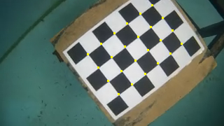
  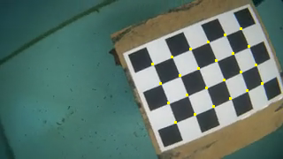
  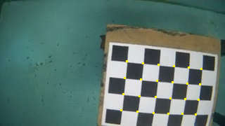
  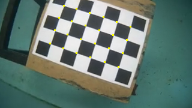
  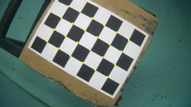
  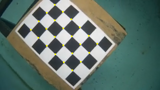
  
  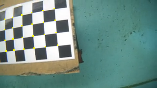
</p>
<p float="left">
  
  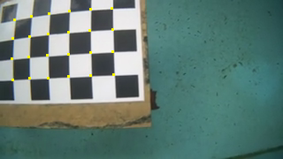
  
  
  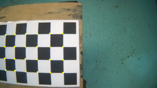
  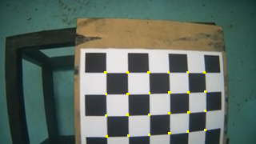
  
  
</p>
<p float="left">
  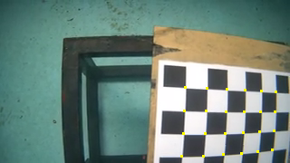
  
  
  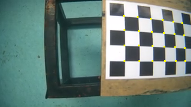
  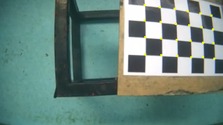
  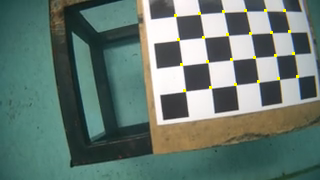
  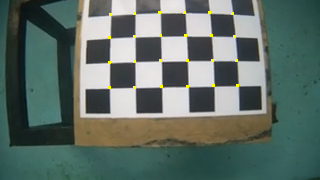
  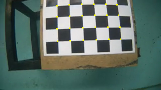
</p>


# Further Settings
## Input Arguments
- [4 rows, 6 columns]
- inpput video filepath
- results directory  
;  
- skipnumber of image frame in the video
```
calibrate_video_checkerboard([4,6],"Vid_20131219_105014_small_180p.mp4","/Users/USERNAME/Desktop/CameraCalibration/results"; numskipframe=10);
```

# Calibrate and send result to default CameraCalibration directory
without skipping any video frame
```
calibrate_video_checkerboard([4,6],"Vid_20131219_105014_small_180p.mp4");
```

# Calibrate and send result to default CameraCalibration directory
- without skipping any video frame
- calibrate all video files in directory username/Desktop/CameraCalibration
```
calibrate_video_checkerboard([4,6]);
```

